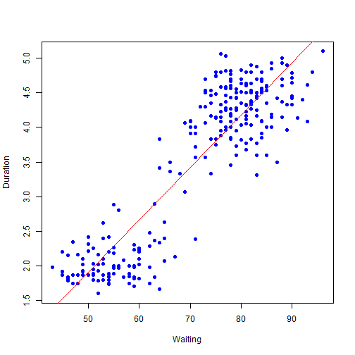

Old Faithful Geyser Eruptions Predictor
========================================================
author: David Hook
date: 1/31/2016

Coursera Data Science Specialization  
Developing Data Products - Final Project

Sales Pitch
========================================================

Ever found yourself in yellowstone national park waiting
for a geyser to erupt? Who hasn't?! The worst part is wondering
to yourself: will the wait be worth it?  
<br>With our new Shiny App you can estimate based on how long you've been waiting how
long the final eruption will be!
* A simple slider on the left makes the app super easy to use
* slide to estimate how long you've been waiting or plan to wait
* on the right side you'll see graph and a large magenta dot indicating how many minutes the eruption will last


Slide With Code
========================================================

Using data carefully gathered and included in the R library, we will use the observations of 272 previous eruptions and the time elapsed before each to predict the average length of an eruption.


```r
data(faithful)
dim(faithful)[1]
```

```
[1] 272
```

```r
summary(faithful)
```

```
   eruptions        waiting    
 Min.   :1.600   Min.   :43.0  
 1st Qu.:2.163   1st Qu.:58.0  
 Median :4.000   Median :76.0  
 Mean   :3.488   Mean   :70.9  
 3rd Qu.:4.454   3rd Qu.:82.0  
 Max.   :5.100   Max.   :96.0  
```


Building our model
========================================================

We build a single coefficient linear model and plot the regression line in red.  


Try it yourself!
===
Now that you see the great value in being able to estimate the approximate duration of a geyser eruption 
using the time you've waited, I doubt you'll ever want to wait without such a valuable tool at your disposal!
Visit our application at shinyio and try it for yourself!  
* <a href="https://lbdavid98.shinyapps.io/FinalProject/">https://lbdavid98.shinyapps.io/FinalProject/</a>
* <a href="https://github.com/LBDavid98/OldFaithful">See the source code at our GitHub Repository</a>

I believe you'll find it meets the requirements for this project exactly, if just barely. :) Cheers!


